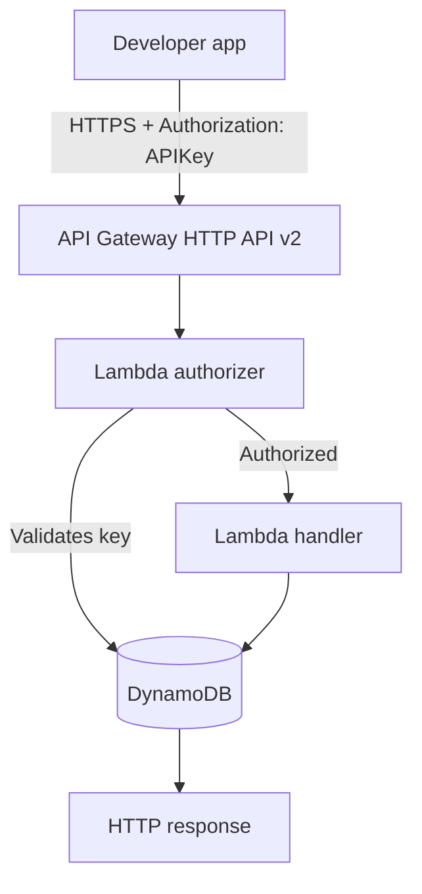

# Architectural overview

Transactionify is a serverless REST API built on AWS. This page explains how the service is structured — from how a request enters the system to how data is stored and returned.

---

## Infrastructure overview

Every request follows this path:


### Components

**API Gateway v2 (HTTP API)** receives all inbound requests and routes them to the appropriate Lambda function based on the HTTP method and path. It never executes business logic directly.

**Lambda authorizer** runs before every request reaches a handler. It reads the `Authorization` header, extracts the API key, and validates it against DynamoDB. If the key is missing or invalid, the request is rejected with a `401 Unauthorized` before any handler runs. Results are not cached so every request is validated in real time.

**Lambda handlers** are single-purpose functions — one per endpoint. Each handler has only the IAM permissions it needs: read-only handlers get `grantReadData`, write handlers get `grantReadWriteData`.

**DynamoDB** stores all data in a single table using the single-table design pattern. Accounts, transactions, and API keys coexist in the same table, distinguished by key prefixes on the `PK` (partition key) and `SK` (sort key).

**Provisioning Lambda** is an internal-only function used to register new users and generate API keys. It is never exposed as an API endpoint.

:::info
The provisioning Lambda is intentionally excluded from the API Gateway routes. API keys can only be issued through direct Lambda invocation — never through an HTTP endpoint.
:::

---

## Code structure

The Python source follows a layered service architecture with four distinct layers:
```
src/python/transactionify/
├── handlers/
│   ├── api/
│   │   └── rest/
│   │       ├── account/
│   │       │   └── create/
│   │       ├── payment/
│   │       │   └── create/
│   │       ├── balance/
│   │       │   └── get/
│   │       └── transaction/
│   │           └── list/
│   ├── authorizer/
│   └── provisioning/
├── services/
│   ├── account/
│   ├── payment/
│   └── transaction/
└── tools/
    ├── generators/
    ├── validators/
    └── response/
```

### Handlers

Entry points for the Lambda runtime. Each handler receives the raw Lambda event, extracts parameters and body, and delegates to a service. Handlers know nothing about business rules — they only parse input and call services.

### Services

Contain all business logic. Services orchestrate reads and writes to DynamoDB, enforce rules (e.g. payment currency must match account currency), and return domain objects. Services know nothing about HTTP or Lambda — they can be called from any handler type.

### Tools

Pure utility functions with no dependencies on the layers above them. Organized into two subtypes:

- **Generators** — produce IDs (UUIDv7), timestamps, pagination cursors, and other computed values.
- **Validators** — validate input data such as currency codes, UUID formats, and required fields.
- **Response** - Responsible for shaping the final HTTP response returned to the caller. Keeps formatting logic (status codes, JSON structure, error messages) out of both handlers and services.

:::tip
Each layer is independently testable. You can unit test a service without invoking Lambda, or test a validator without a database connection.
:::

---

## Request lifecycle

Here is what happens during a `POST /api/v1/accounts` request:

1. The developer app sends a `POST` request with `Authorization: APIKey <key>` and `{"currency": "USD"}` in the body.
2. API Gateway receives the request and invokes the Lambda authorizer.
3. The authorizer reads the API key from the header and queries DynamoDB. If invalid, returns `401`.
4. API Gateway routes the authorized request to the `account.create` handler.
5. The handler parses the request body and calls the account service.
6. The account service validates the currency via the validators tool, generates a UUIDv7 account ID via the generators tool, and writes the new account to DynamoDB.
7. The response layer formats and returns the result:
```json
{
  "id": "019a4757-c049-7ea8-a110-2ea110c5a6f8",
  "balance": {
    "value": "0.00",
    "currency": "USD"
  }
}
```

---

## Endpoints

| Method | Path | Description |
|--------|------|-------------|
| `POST` | `/api/v1/accounts` | Creates a new account with zero balance |
| `POST` | `/api/v1/accounts/{account_id}/payments` | Creates a payment for an account |
| `GET` | `/api/v1/accounts/{account_id}/balance` | Returns current balance and server timestamp |
| `GET` | `/api/v1/accounts/{account_id}/transactions` | Returns paginated transaction history |

All endpoints require `Authorization: APIKey <key>` in the request header.

---

## Authentication

API keys are provisioned out-of-band via the internal provisioning Lambda. Once issued, a key must be passed on every request:
```http
Authorization: APIKey <your-api-key>
```

The Lambda authorizer validates the key on every request with no caching. Invalid or missing keys receive a `401` response immediately — before any handler or business logic runs.

:::warning
Never expose your API key in client-side code or public repositories. Treat it like a password.
:::

---

## Data model

Transactionify uses DynamoDB's single-table design. All entities share one table and are distinguished by key prefixes:

| Entity | PK | SK |
|--------|----|----|
| Account | `ACCOUNT#<account_id>` | `ACCOUNT#<account_id>` |
| Transaction | `ACCOUNT#<account_id>` | `TRANSACTION#<transaction_id>` |
| API key | `APIKEY#<key>` | `APIKEY#<key>` |

Transaction history is queried by account using a key condition on `PK` with cursor-based pagination. The cursor is a base64-encoded DynamoDB `LastEvaluatedKey`.